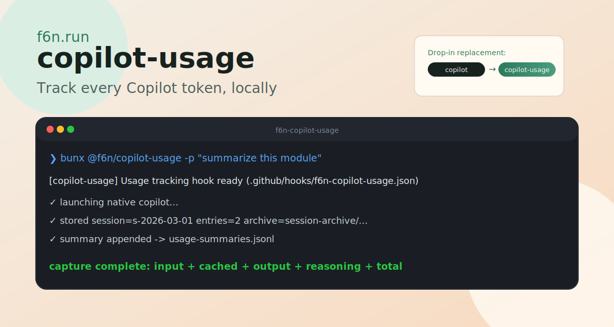
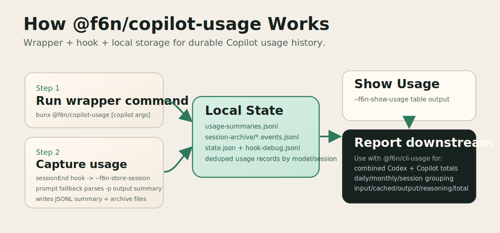

# @f6n/copilot-usage

`@f6n/copilot-usage` is a drop-in wrapper for GitHub Copilot CLI that captures usage data locally while keeping your normal Copilot workflow.

Live site: https://copilot-usage.f6n.run  
Repository: https://github.com/Ashwinning/copilot-usage



## What This App Does

- Runs native `copilot` with your same flags and interactive behavior
- Installs and maintains a repo session-end hook at `.github/hooks/f6n-copilot-usage.json` when inside a Git repo
- Falls back to direct latest-session capture when run outside a Git repo
- Captures usage into local JSONL files so you can inspect usage history later
- Supports prompt-mode fallback capture (`-p` / `--prompt`) from Copilot terminal output

No cloud service is required. Data stays on your machine.

## How It Works



1. You run `bunx @f6n/copilot-usage` (instead of `copilot`).
2. In Git repos, the wrapper ensures the hook file exists in your current repository.
3. Copilot runs normally.
4. On session end, the hook invokes `--f6n-store-session` and stores usage from latest Copilot events.
   When not in a Git repo, the wrapper captures from latest Copilot session state directly after the run.
5. Stored summaries are readable via `--f6n-show-usage` and consumable by `@f6n/cli-usage`.

## First-Time Setup (Step by Step)

1. Run Copilot through the wrapper:

```bash
bunx @f6n/copilot-usage
```

2. Confirm hook installation in your repo:

```text
.github/hooks/f6n-copilot-usage.json
```

3. Run at least one Copilot session.

4. View stored usage:

```bash
bunx @f6n/copilot-usage --f6n-show-usage
```

5. For combined Codex + Copilot reporting:

```bash
bunx @f6n/cli-usage
```

## Daily Usage

Interactive session:

```bash
bunx @f6n/copilot-usage
```

Prompt mode:

```bash
bunx @f6n/copilot-usage -p "explain this file"
```

Show stored data quickly:

```bash
bunx @f6n/copilot-usage --f6n-show-usage
```

## CLI Flags

Wrapper-only flags (reserved by this tool):

| Flag | What it does |
| --- | --- |
| `--f6n-store-session` | Internal hook mode: captures latest Copilot session from local state |
| `--f6n-show-usage` | Prints stored usage table and exits |
| `--f6n-state-home <path>` | Overrides wrapper state directory |
| `--f6n-copilot-home <path>` | Overrides Copilot state directory |

All non-`--f6n*` flags are forwarded to native `copilot`.

## What Gets Stored

Default state root:

- Windows: `%USERPROFILE%\.f6n-copilot-usage\`
- macOS: `~/Library/Application Support/f6n-copilot-usage/`
- Linux: `~/.f6n-copilot-usage/`

Files:

- `usage-summaries.jsonl`: captured session/prompt summaries
- `session-archive/*.events.jsonl`: archived Copilot events snapshots
- `state.json`: per-repo hook metadata
- `hook-debug.jsonl`: capture/debug stage logs

Copilot home default used for session-state discovery:

- `$XDG_STATE_HOME/.copilot` when `XDG_STATE_HOME` exists
- otherwise `~/.copilot`
- overridable with `--f6n-copilot-home` or `COPILOT_HOME`

## Output You Will See

The `--f6n-show-usage` command prints one auto-selected table:

- `sessions` when activity span is under 1 day
- `daily` when activity span is under 1 month
- `monthly` for longer ranges

Token columns:

- `Input`
- `Cached`
- `Output`
- `Reasoning`
- `Total`

## Troubleshooting

- If usage is empty, run a fresh Copilot session through the wrapper and re-check `--f6n-show-usage`.
- If hook issues are suspected, inspect `hook-debug.jsonl`.
- If Copilot state is in a non-default location, pass `--f6n-copilot-home <path>`.
- If state should be isolated per environment, pass `--f6n-state-home <path>`.

## Relationship to `@f6n/cli-usage`

- `@f6n/copilot-usage` captures and persists Copilot usage
- `@f6n/cli-usage` reports combined Codex + Copilot usage in one table

Companion site: https://cli-usage.f6n.run

## Development

```bash
npm install
npm run build
npm run test
```

Run locally from source:

```bash
node dist/cli.js [copilot args...]
```

## Links

- Copilot usage website: https://copilot-usage.f6n.run
- Copilot usage repository: https://github.com/Ashwinning/copilot-usage
- f6n.run monorepo: https://github.com/Ashwinning/f6n.run
